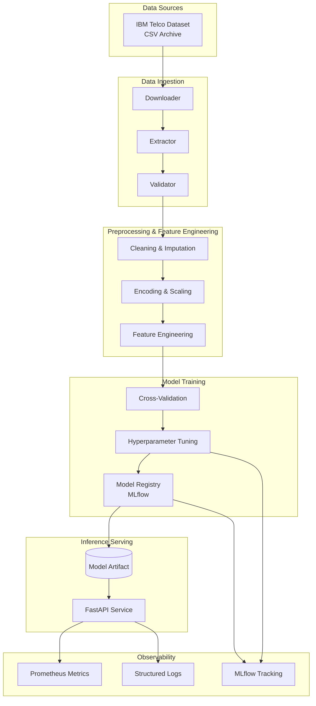
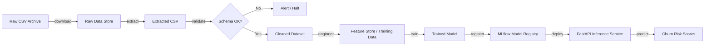
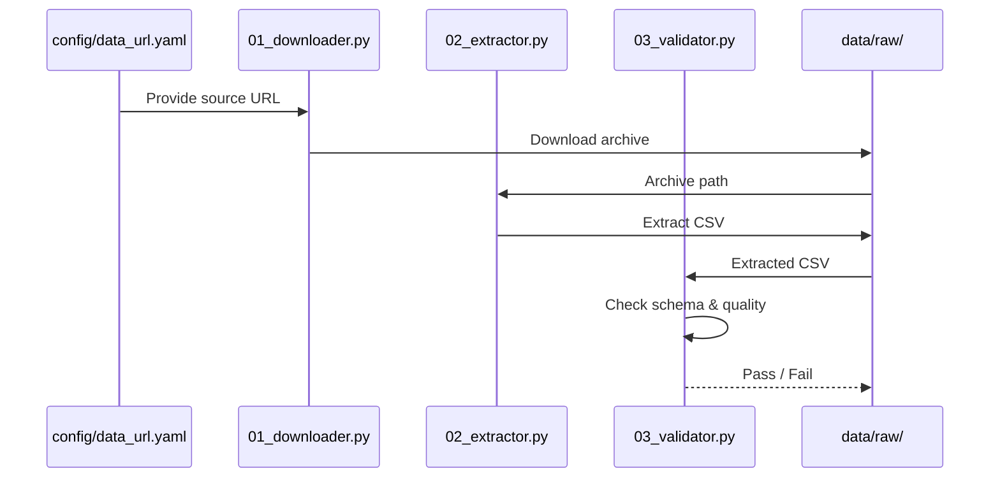
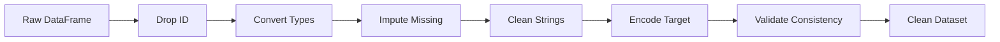
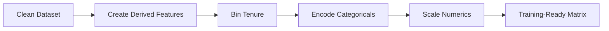
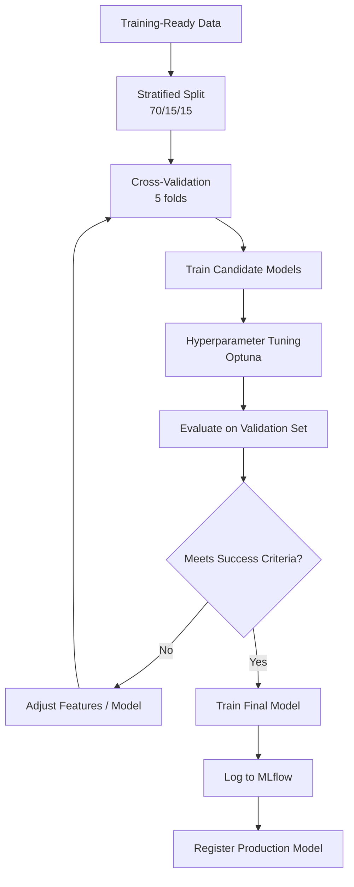
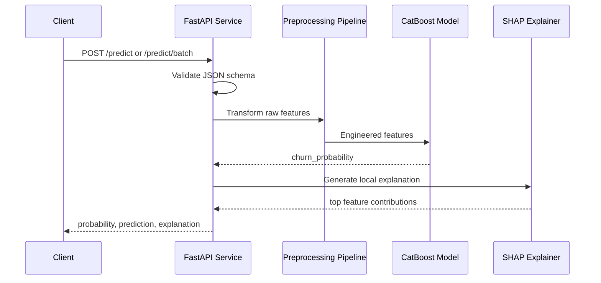
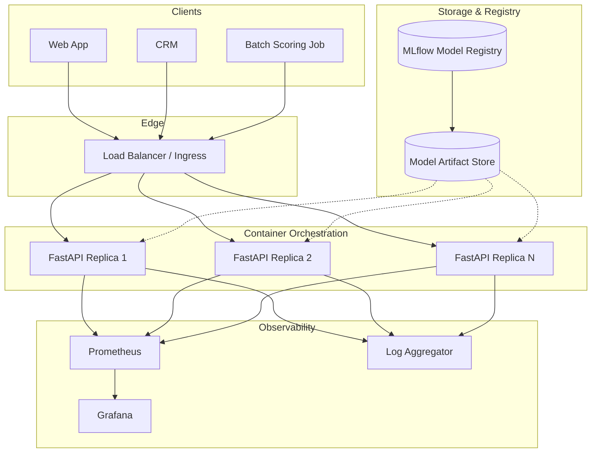
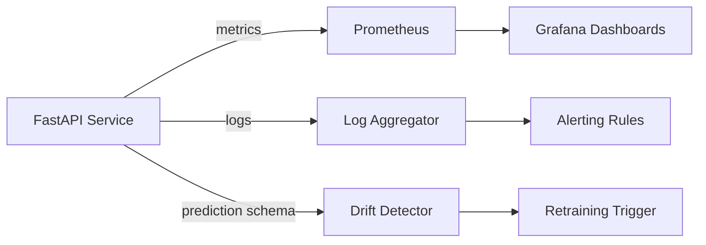

# Telco Customer Churn Prediction — Architecture Documentation

---

## 1. High-Level Architecture

The system is a modular, production-grade machine learning platform for predicting telecom customer churn. It follows a pipeline-based architecture separating data ingestion, preprocessing, model training, inference, and monitoring concerns.



---

## 2. Data Flow

Data moves through the system in distinct stages, each producing validated, versioned artifacts.



### Stages
1. **Download**: Fetch raw archive from configured source URL.
2. **Extract**: Unzip and place CSV in the raw data directory.
3. **Validate**: Enforce schema, types, ranges, and missing-value thresholds.
4. **Clean**: Impute missing values, fix types, remove identifiers.
5. **Engineer**: Create derived features and encode for modeling.
6. **Train**: Fit and compare candidate models; select best performer.
7. **Register**: Log model, metrics, and preprocessing artifacts to MLflow.
8. **Serve**: Load model into FastAPI and expose prediction endpoints.
9. **Monitor**: Track predictions, latency, errors, and drift.

---

## 3. Data Ingestion

### Components
| Module | File | Responsibility |
|---|---|---|
| Downloader | `src/data/01_downloader.py` | Download raw dataset archive from configured URL |
| Extractor | `src/data/02_extractor.py` | Decompress archive into `data/raw/extracted/` |
| Validator | `src/data/03_validator.py` | Validate schema, types, ranges, and duplicates |
| Pipeline | `src/data/04_pipeline.py` | Orchestrate ingestion end-to-end |

### Ingestion Flow



### Design Decisions
- Source URLs are externalized to `config/data_url.yaml` for environment flexibility.
- Validation runs before any transformation to fail fast on data quality issues.
- Logs capture row counts, validation status, and failure reasons.

---

## 4. Data Preprocessing

Preprocessing prepares raw data for modeling while preserving reproducibility.

### Steps
1. **Identifier removal**: Drop `customerID`.
2. **Type conversion**: Convert `TotalCharges` to float; coerce invalid values to NaN.
3. **Missing value imputation**:
   - If `tenure == 0`, set `TotalCharges = 0.0`.
   - Otherwise, impute `TotalCharges = tenure × MonthlyCharges`.
4. **Whitespace cleanup**: Strip categorical strings.
5. **Target encoding**: Map `Churn` to `{Yes: 1, No: 0}`.
6. **Consistency checks**: Assert non-negative charges and valid tenure range.

### Preprocessing Pipeline



---

## 5. Feature Engineering

Engineered features capture domain knowledge and improve model discrimination.

### Engineered Features
| Feature | Formula / Rule |
|---|---|
| `avg_monthly_charge` | `TotalCharges / tenure` when `tenure > 0` |
| `tenure_group` | Binned: `0-12`, `13-24`, `25-48`, `49-60`, `61+` |
| `has_internet` | `InternetService != 'No'` |
| `has_phone` | `PhoneService == 'Yes'` |
| `num_addons` | Count of security/backup/support/protection add-ons |
| `is_month_to_month` | `Contract == 'Month-to-month'` |
| `is_electronic_check` | `PaymentMethod == 'Electronic check'` |

### Encoding Strategy
| Model Type | Encoding |
|---|---|
| Linear models | One-hot encoding + `StandardScaler` |
| Tree ensembles | Native categorical handling or label encoding |
| CatBoost | Native categorical features passed directly |

### Feature Engineering Flow



---

## 6. Model Training Pipeline

The training pipeline is modular, reproducible, and experiment-tracked.

### Pipeline Steps



### Candidate Models
- Logistic Regression
- Random Forest
- XGBoost
- LightGBM
- CatBoost

### Key Controls
- Stratified splits and cross-validation preserve class distribution.
- Class weights and threshold tuning address imbalance.
- Random seeds are fixed across all libraries.
- Hyperparameters, metrics, artifacts, and code version are logged to MLflow.

---

## 7. Inference Pipeline

The inference pipeline loads the registered model and serves predictions via REST API.

### Inference Flow



### Endpoints
| Endpoint | Purpose |
|---|---|
| `POST /predict` | Single-record prediction with explanation |
| `POST /predict/batch` | Batch scoring up to `MAX_BATCH_SIZE` records |
| `GET /health` | Service and model load status |
| `GET /ready` | Readiness for load balancers |
| `GET /metrics` | Prometheus metrics |

### Latency Targets
- p95 single prediction: < 100 ms
- p95 batch prediction (≤ 100 records): < 200 ms

---

## 8. Deployment Architecture

The service is deployed as a stateless container behind a load balancer.



### Deployment Options
| Environment | Tool | Notes |
|---|---|---|
| Local | Poetry + Uvicorn | Development and debugging |
| Single host | Docker Compose | Staging and small production |
| Production | Kubernetes | Auto-scaling, rolling updates, high availability |

---

## 9. Monitoring Architecture

Monitoring covers system health, model performance, and data quality.



### Monitored Signals
| Layer | Signal | Tool |
|---|---|---|
| System | CPU, memory, disk, network | Prometheus + node-exporter |
| Application | Request rate, latency, errors | Prometheus metrics |
| Model | Prediction distribution, AUC degradation | MLflow + drift detector |
| Data | Schema violations, missing values, drift | Validator + Great Expectations |
| Business | Recall, precision, campaign ROI | BI / reporting layer |

### Alerting Rules
| Condition | Severity |
|---|---|
| `/health` returns `model_loaded: false` | Critical |
| p95 latency > 300 ms | Warning |
| 5xx error rate > 1% | Critical |
| Input schema validation failure rate > 0.5% | Warning |
| Prediction distribution shift detected | Warning |

---

## 10. Folder Structure Overview

```text
Telco_Customer_Churn/
├── config/                     # Configuration files
│   └── data_url.yaml           # Data source URLs
├── data/                       # Data artifacts
│   ├── raw/                    # Downloaded and extracted raw data
│   └── processed/              # Cleaned and engineered datasets
├── docs/                       # Project documentation
│   ├── README.md
│   ├── project_overview.md
│   ├── data_documentation.md
│   ├── model_documentation.md
│   ├── architecture.md
│   └── deployment_guide.md
├── notebook/                   # EDA and experimentation notebooks
├── src/                        # Production source code
│   ├── api/                    # FastAPI application
│   │   ├── app.py
│   │   ├── models.py
│   │   └── routers/
│   ├── data/                   # Data pipeline modules
│   │   ├── 01_downloader.py
│   │   ├── 02_extractor.py
│   │   ├── 03_validator.py
│   │   └── 04_pipeline.py
│   ├── features/               # Feature engineering and selection
│   │   ├── build_features.py
│   │   └── preprocess.py
│   ├── models/                 # Model training, tuning, and registry
│   │   ├── train.py
│   │   ├── evaluate.py
│   │   └── registry.py
│   └── utils/                  # Shared utilities
│       └── logger.py
├── tests/                      # Unit and integration tests
├── Dockerfile                  # Container image definition
├── docker-compose.yml          # Local multi-service deployment
├── pyproject.toml              # Poetry project and tool config
├── poetry.lock                 # Locked dependency graph
└── README.md                   # Public project overview
```

---

## 11. Design Principles

| Principle | Application |
|---|---|
| **Modularity** | Each pipeline stage is a separate module with a single responsibility. |
| **Reproducibility** | Fixed random seeds, locked dependencies, versioned data, and MLflow tracking. |
| **Testability** | Unit tests for each component; integration tests for pipeline and API. |
| **Observability** | Structured logs, Prometheus metrics, and health/readiness endpoints. |
| **Scalability** | Stateless service design supports horizontal scaling. |
| **Maintainability** | Clear naming, type hints, docstrings, and separation of concerns. |
| **Portability** | Docker containerization ensures consistent runtime across environments. |
| **Security** | Non-root container user, read-only model mounts, input validation, and no secrets in images. |
| **Extensibility** | New models, features, and data sources can be added without rewriting core logic. |

---

## 12. Document Control

| Property | Value |
|---|---|
| Version | 1.0 |
| Author | Richard Obeng |
| Last Updated | 2026-07-31 |
| Review Cycle | Per release or quarterly |
| Related Documents | `project_overview.md`, `model_documentation.md`, `deployment_quide.md` |
